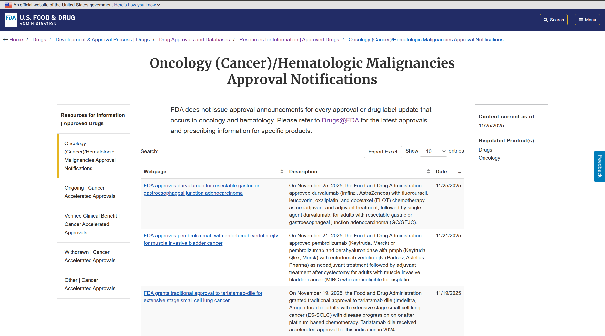
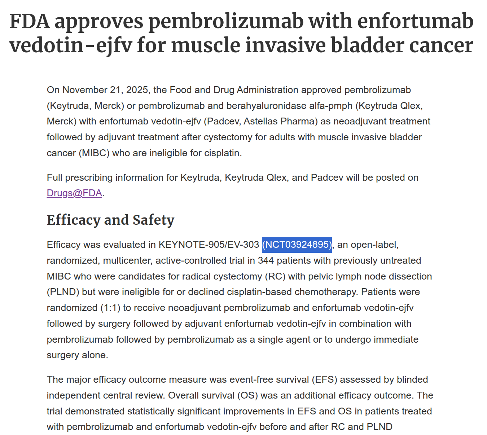

<style type="text/css">
.main-container {
  max-width: 1200px;
  margin-left: auto;
  margin-right: auto;
}
</style>


```{r setup, include=FALSE}
knitr::opts_chunk$set(echo = TRUE,
                      fig.align = "center", # center all figures
                      fig.width = 10, # width in inches for R plots
                      fig.height = 8, # height in inches for R plots
                      out.width = "80%" # scale figure width in the HTML
)

```

# 1. [FDA Approval Notifications](https://www.fda.gov/drugs/resources-information-approved-drugs/oncology-cancerhematologic-malignancies-approval-notifications)

Retrieve [approval notifications](https://www.fda.gov/drugs/resources-information-approved-drugs/oncology-cancerhematologic-malignancies-approval-notifications) from the FDA:

```{r, echo=FALSE, fig.cap="FDA approval notifications web page"}

```


For each notification, there is a description text with information, including the **NCTxxxxxxxx** IDs:

```{r, echo=FALSE, fig.cap="Notifications approval text"}

```


## 1.1 Filter to keep approvals for drug combinations

**First simple strategy**

1. Use three LLM (phi4, qwen2.5, llama3.1) to classify the approval notifications in `single` or `combination` based on the **Description** text.
2. First approach: keep only those in which there is agreement in the three LLM result.
3. Access to the notification url and extract the **NCT** IDs if present.

**Results:**

```{r, echo=FALSE, message=FALSE}
library(DT)
library(tidyverse)
approval_notifications_annotated <- openxlsx2::read_xlsx("../results/FDA/approval_notifications_combinations_1stdraft.xlsx")
approval_notifications_annotated <- approval_notifications_annotated %>%
  mutate(text = str_trunc(text, width = 80, side = "right"),
         description = str_trunc(description, width = 80, side = "right"),
         phi4 = str_trunc(phi4, width = 80, side = "right"))

datatable(
  width = "100%",
  approval_notifications_annotated,
  #filter = "top",
  options = list(pageLength = 5, scrollX = TRUE)
)

```

### TO DO

1. Solve conflicting LLM results regarding single vs combination notification approvals.
2. Estimation of accuracy of LLM classification.
3. Obtain NCT for those notification for which no NCT was found.


# 2. [ClinicalTrials.gov](https://www.clinicaltrials.gov/)

Retrieve information from studies using the [ClinicalTrials.gov API](https://www.clinicaltrials.gov/data-api/api) and the **NCT** identifiers:

- Condition: `cancer OR neoplasms OR tumor`
- Filters: `phase:2 3 4,results:with,status:act com ter` (phase 2, 3, or 4, with results, status: active nor recruiting, completed, or terminated)

Some figures:

- 23 approval notifications originate from some clinical trial that has been also used for granting another approval.
  - This is due, for example, for re-definitions or ratification of accelerated approvals.
- 26 approval notifications do not have a linked study from ClinicalTrials.gov due to:
  - Results not posted
  - The condition is not cancer. E.g.: [FDA grants accelerated approval to Darzalex Faspro for newly diagnosed light chain amyloidosis](https://www.fda.gov/drugs/resources-information-approved-drugs/fda-grants-accelerated-approval-darzalex-faspro-newly-diagnosed-light-chain-amyloidosis)


## 2.1 Retrieve drug InChi keys from [ClinicalTrials.gov API](https://www.clinicaltrials.gov/data-api/api) and [ChEMBL](https://chembl.gitbook.io/chembl-interface-documentation)

1. Extract drug names from ClinicalTrials.gov API interventions module.
2. Query ChEMBL to retrieve InChi keys.

```{r, echo=FALSE, message=FALSE, warning=FALSE}
approval_notifications_InChi <- openxlsx2::read_xlsx("../results/FDA/approval_notifications_combinations_1stdraft_InChIKeys_filtered.xlsx")

approval_notifications_InChi <- approval_notifications_InChi %>%
  mutate(text = str_trunc(text, width = 80, side = "right"),
         description = str_trunc(description, width = 80, side = "right"),
         phi4 = str_trunc(phi4, width = 80, side = "right"),
         armGroupLabels = str_trunc(armGroupLabels, width = 80, side = "right"))

datatable(
  width = "100%",
  approval_notifications_InChi,
  #filter = "top",
  options = list(pageLength = 5, scrollX = TRUE)
)

```

Drugs with no InChI keys:

- Clinical trial information not retrieved (because of the reasons given above).
- InChI key not available (e.g., antibodies, metal-containing compounds).

## 2.2 Retrive clinical trials information

Glimpse of retrieval (just from the protocol section) for studies in which:

- For drug combinations (as filtered above).
- NCT was available in the FDA web.
- Study fit the filters in the ClinicalTrial.gov API.
- Have drugs with InChI keys

```{r, eval=FALSE}

protocolSection <- function(study) {

  tibble(
    # IdentificationModule
    nctId = study$protocolSection$identificationModule$nctId,
    BriefTitle = study$protocolSection$identificationModule$briefTitle,
    OfficialTitle = study$protocolSection$identificationModule$officialTitle,
    Acronym = study$protocolSection$identificationModule$acronym,
    OrgFullName = study$protocolSection$identificationModule$organization$fullName,
    OrgClass = study$protocolSection$identificationModule$organization$class,
    
    # StatusModule
    StatusVerifiedDate = study$protocolSection$statusModule$statusVerifiedDate,
    OverallStatus = study$protocolSection$statusModule$overallStatus,
    WhyStopped = study$protocolSection$statusModule$whyStopped,
    HasExpandedAccess = study$rotocolSection$statusModule$expandedAccessInfo$hasExpandedAccess,
    ExpandedAccessStatusForNCTId = study$protocolSection$statusModule$expandedAccessInfo$statusForNctId,
    StartDate = study$protocolSection$statusModule$startDateStruct$date,
    StartDateType = study$protocolSection$statusModule$startDateStruct$type,
    PrimaryCompletionDate = study$protocolSection$statusModule$primaryCompletionDateStruct$date,
    PrimaryCompletionDateType = study$protocolSection$statusModule$primaryCompletionDateStruct$type,
    CompletionDate = study$protocolSection$statusModule$completionDateStruct$date,
    CompletionDateType = study$protocolSection$statusModule$completionDateStruct$type,
    StudyFirstPostDate = study$protocolSection$statusModule$studyFirstPostDateStruct$date,
    StudyFirstPostDateType = study$protocolSection$statusModule$studyFirstPostDateStruct$type,
    ResultsFirstPostDate = study$protocolSection$statusModule$resultsFirstPostDateStruct$date,
    DispFirstPostDate = study$protocolSection$statusModule$dispFirstPostDateStruct$date,
    LastUpdatePostDate = study$protocolSection$statusModule$lastUpdatePostDateStruct$date,
    LastUpdatePostDateType = study$protocolSection$statusModule$lastUpdatePostDateStruct$type,
    
    # SponsorCollaboratorsModule
    ResponsiblePartyType = study$protocolSection$sponsorCollaboratorsModule$responsibleParty$type,
    LeadSponsorName = study$protocolSection$sponsorCollaboratorsModule$leadSponsor$name,
    LeadSponsorClass = study$protocolSection$sponsorCollaboratorsModule$leadSponsor$class,
    CollaboratorName = study$protocolSection$sponsorCollaboratorsModule$collaborators$name,
    CollaboratorClass = study$protocolSection$sponsorCollaboratorsModule$collaborators$class,
    NumCollaborators = study$protocolSection$sponsorCollaboratorsModule$numCollaborators,
    NumCollaboratorsPlusLead = study$protocolSection$sponsorCollaboratorsModule$numCollaboratorsPlusLead,
    
    # OversightModule
    OversightHasDMC = study$protocolSection$oversightModule$oversightHasDmc,
    IsFDARegulatedDrug = study$protocolSection$oversightModule$isFdaRegulatedDrug,
    IsFDARegulatedDevice = study$protocolSection$oversightModule$isFdaRegulatedDevice,
    IsUnapprovedDevice = study$protocolSection$oversightModule$isUnapprovedDevice,
    IsPPSD = study$protocolSection$oversightModule$isPpsd,
    IsUSExport = study$protocolSection$oversightModule$isUsExport,
    FDAAA801Violation = study$protocolSection$oversightModule$fdaaa801Violation,
    
    # DescriptionModule
    
    BriefSummary = study$protocolSection$descriptionModule$briefSummary,
    DetailedDescription = study$protocolSection$descriptionModule$detailedDescription,
    
    # ConditionsModule
    
    Condition = paste0(study$protocolSection$conditionsModule$conditions, collapse = ";"),
    NumConditions = length(study$protocolSection$conditionsModule$conditions),
    Keyword = paste0(study$protocolSection$conditionsModule$keywords, collapse = ";"),
    
    # DesignModule
    
    StudyType = study$protocolSection$designModule$studyType,
    NPtrsToThisExpAccNCTId = study$protocolSection$designModule$nPtrsToThisExpAccNctId,
    ExpAccTypeIndividual = study$protocolSection$designModule$expandedAccessTypes$individual,
    ExpAccTypeIntermediate = study$protocolSection$designModule$expandedAccessTypes$intermediate,
    ExpAccTypeTreatment = study$protocolSection$designModule$expandedAccessTypes$treatment,
    PatientRegistry = study$protocolSection$designModule$patientRegistry,
    TargetDuration = study$protocolSection$designModule$targetDuration,
    Phase = paste0(study$protocolSection$designModule$phases, collapse = ";"),
    NumPhases = length(study$protocolSection$designModule$phases),
    DesignAllocation = study$protocolSection$designModule$designInfo$allocation,
    DesignInterventionModel = study$protocolSection$designModule$designInfo$interventionModel,
    DesignInterventionModelDescription = study$protocolSection$designModule$designInfo$interventionModelDescription,
    DesignPrimaryPurpose = study$protocolSection$designModule$designInfo$primaryPurpose,
    DesignObservationalModel = study$protocolSection$designModule$designInfo$observationalModel,
    DesignTimePerspective = study$protocolSection$designModule$designInfo$timePerspective,
    DesignMasking = study$protocolSection$designModule$designInfo$maskingInfo$masking,
    DesignMaskingDescription = study$protocolSection$designModule$designInfo$maskingInfo$maskingDescription,
    DesignWhoMasked = paste0(study$protocolSection$designModule$designInfo$maskingInfo$whoMasked, collapse = ";"),
    BioSpecRetention = study$protocolSection$designModule$bioSpec$retention,
    BioSpecDescription = study$protocolSection$designModule$bioSpec$retention,
    EnrollmentCount = study$protocolSection$designModule$enrollmentInfo$count,
    EnrollmentType = study$protocolSection$designModule$enrollmentInfo$type,
    ArmGroupLabel = collapse_field(study$protocolSection$armsInterventionsModule$armGroups,"label"),
    ArmGroupType = collapse_field(study$protocolSection$armsInterventionsModule$armGroups,"type"),
    ArmGroupDescription = collapse_field(study$protocolSection$armsInterventionsModule$armGroups, "description"),
    ArmGroupInterventionName = collapse_field(study$protocolSection$armsInterventionsModule$armGroups, "interventionNames"),
    #NumArmGroupInterventionNames = study$protocolSection$armsInterventionsModule$armGroups$numArmGroupInterventionNames,
    NumArmGroups = length(study$protocolSection$armsInterventionsModule$armGroups),
    InterventionType = collapse_field(study$protocolSection$armsInterventionsModule$interventions,"type"),
    InterventionName = collapse_field(study$protocolSection$armsInterventionsModule$interventions, "name"),
    InterventionDescription = collapse_field(study$protocolSection$armsInterventionsModule$interventions, "description"),
    InterventionArmGroupLabel = collapse_field(study$protocolSection$armsInterventionsModule$interventions, "armGroupLabels"),
    #NumInterventionArmGroupLabels = study$protocolSection$armsInterventionsModule$interventions$numInterventionArmGroupLabels,
    InterventionOtherName = collapse_field(study$protocolSection$armsInterventionsModule$interventions, "otherNames"),
    #NumInterventionOtherNames = study$protocolSection$armsInterventionsModule$interventions$numInterventionOtherNames, 
    NumInterventions = length(study$protocolSection$armsInterventionsModule$interventions),
    
    # OutcomesModule
    
    PrimaryOutcomeMeasure = study$protocolSection$outcomesModule$primaryOutcomes$measure,
    PrimaryOutcomeDescription = study$protocolSection$outcomesModule$primaryOutcomes$description,
    PrimaryOutcomeTimeFrame = study$protocolSection$outcomesModule$primaryOutcomes$timeFrame,
    #NumPrimaryOutcomes = study$protocolSection$outcomesModule$numPrimaryOutcomes,
    SecondaryOutcomeMeasure = study$protocolSection$outcomesModule$secondaryOutcomes$measure,
    SecondaryOutcomeDescription = study$protocolSection$outcomesModule$secondaryOutcomes$description,
    SecondaryOutcomeTimeFrame = study$protocolSection$outcomesModule$secondaryOutcomes$timeFrame,
    #NumSecondaryOutcomes = study$protocolSection$outcomesModule$numSecondaryOutcomes,
    OtherOutcomeMeasure = study$protocolSection$outcomesModule$otherOutcomes$measure,
    OtherOutcomeDescription = study$protocolSection$outcomesModule$otherOutcomes$description,
    OtherOutcomeTimeFrame = study$protocolSection$outcomesModule$otherOutcomes$timeFrame,
    #NumOtherOutcomes = study$protocolSection$outcomesModule$numOtherOutcomes,
    #NumOutcomes = study$protocolSection$outcomesModule$numOutcomes,
    
    # EligibilityModule
    
    EligibilityCriteria = study$protocolSection$eligibilityModule$eligibilityCriteria,
    HealthyVolunteers = study$protocolSection$eligibilityModule$healthyVolunteers,
    Sex = study$protocolSection$eligibilityModule$sex,
    GenderBased = study$protocolSection$eligibilityModule$genderBased,
    GenderDescription = study$protocolSection$eligibilityModule$genderDescription,
    MinimumAge = study$protocolSection$eligibilityModule$minimumAge,
    MaximumAge = study$protocolSection$eligibilityModule$maximumAge,
    StdAge = paste0(study$protocolSection$eligibilityModule$stdAges, collapse = ";"),
    NumStdAges = length(study$protocolSection$eligibilityModule$stdAges),
    StudyPopulation = study$protocolSection$eligibilityModule$studyPopulation,
    SamplingMethod = study$protocolSection$eligibilityModule$samplingMethod,
    
    # ContactsLocationsModule
    
    NumCentralContacts = study$protocolSection$contactsLocationsModule$numCentralContacts,
    NumOverallOfficials = study$protocolSection$contactsLocationsModule$numOverallOfficials,
    LocationCountry = study$protocolSection$contactsLocationsModule$locations$country,
    NumLocationContacts = study$protocolSection$contactsLocationsModule$locations$numLocationContacts,
    LocationCountryCode = study$protocolSection$contactsLocationsModule$locations$countryCode,
    LocationGeoPoint = study$protocolSection$contactsLocationsModule$locations$geoPoint,
    NumLocations = study$protocolSection$contactsLocationsModule$numLocations,
    NumUniqueLocationCountries = study$protocolSection$contactsLocationsModule$numUniqueLocationCountries,
    
    # ReferencesModule
    
    ReferencePMID = study$protocolSection$referencesModule$references$pmid,
    RetractionPMID = study$protocolSection$referencesModule$references$retractions$pmid,
    RetractionSource = study$protocolSection$referencesModule$references$retractions$source,
    #NumRetractionsForRef = study$protocolSection$referencesModule$references$numRetractionsForRef,
    #NumReferences = study$protocolSection$referencesModule$numReferences,
    #NumRetractionsAllRefs = study$protocolSection$referencesModule$numRetractionsAllRefs,
    AvailIPDType = study$protocolSection$referencesModule$availIpds$type,
    
    # IPDSharingStatementModule
    
    IPDSharing = study$protocolSection$ipdSharingStatementModule$ipdSharing,
    #IPDSharingInfoType = study$protocolSection$ipdSharingStatementModule$infoTypes,
    #NumIPDSharingInfoTypes = study$protocolSection.ipdSharingStatementModule.numIpdSharingInfoTypes,
    
  )
}
```


```{r, echo=FALSE, message=FALSE, warning=FALSE}
protSection <- openxlsx2::read_xlsx("../results/ClinicalTrials/protocolSection.xlsx")


datatable(
  width = "100%",
  str_trunc(protSection, width = 80, side = "right"),
  #filter = "top",
  options = list(pageLength = 5, scrollX = TRUE)
)

```

## 2.3 Filtering strategy to select drug combination studies

Use `qwen3:8b` and `deepseek-r1:8b` to classify studies based on **brief summary**, **arm group labels**, and **arm group descriptions**:

```{r, eval=FALSE}
qwen3_class <- make_query(
  text     = llm_protSection$classification_text,
  template = "TRIAL INFORMATION:\n{text}\n\nTASK:\n{prompt}",
  prompt   = "Categories: single, combination",
  system = paste(
    "You are a biomedical trial classifier.",
    "",
    "Your task:",
    "Decide whether each clinical study involves AT LEAST ONE ARM in which",
    "TWO OR MORE DRUGS are given together as part of the cancer treatment regimen.",
    "",
    "Definitions:",
    "- 'combination' = at least one arm uses TWO OR MORE DRUGS together",
    "  as active treatment for the disease.",
    "- 'single' = all arms use at most ONE DRUG at a time for active treatment,",
    "  even if there are multiple arms (e.g. drug vs placebo, or drug A vs drug B).",
    "",
    "Important rules:",
    "- Only count pharmacologically active DRUGS used to treat the disease.",
    "- Do NOT count:",
    "  - placebo, saline, vehicle, or sham treatments;",
    "  - non-drug interventions (exercise, behavioral, dietary supplement only, devices);",
    "- If ANY arm clearly treats patients with two or more drugs TOGETHER",
    "  (e.g. 'T-DM1 + Vinorelbine', 'cisplatin + etoposide'), classify as 'combination'.",
    "- If all arms are single-drug or non-drug, classify as 'single'.",
    "",
    "Output format:",
    "- Answer with EXACTLY ONE WORD: 'single' or 'combination'.",
    "- Do NOT explain your answer."
  ),
  examples = examples_fs
) %>%
  query(model = "qwen3:8b",
        screen = FALSE,
        output = "text") |>
  tolower() %>%
  trimws()
```

```{r, echo=FALSE, message=FALSE, warning=FALSE}
llm_clintrials <- openxlsx2::read_xlsx("../results/ClinicalTrials/protocolSection_llm.xlsx")
llm_clintrials <- llm_clintrials %>% select(nctId, BriefSummary, qwen3, deepseek)

datatable(
  width = "100%",
  llm_clintrials,
  #filter = "top",
  options = list(pageLength = 5, scrollX = TRUE)
)

```


### TO DO

1. Create filtering strategy to select drug combinations studies from ClinicalTrials.gov. (in progress)
2. Review drug names to retrieve InChI keys.
3. Complete information retrieval from ClinicalTrials.gov.
4. Harmonize information obtained from ClinicalTrials.gov.

